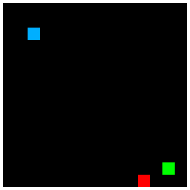
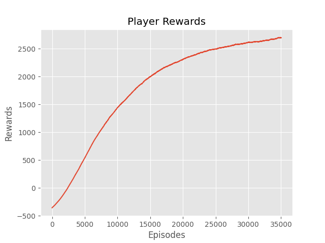

# Custom Blob RL Environment

This project implements a simple Reinforcement Learning (RL) environment where a player navigates a grid to collect food while avoiding an enemy. The agent learns to maximize rewards using Q-learning, with proximity rewards for approaching the food and penalties for colliding with the enemy or moving unnecessarily.

---

## **Features**

- A 15x15 grid environment.
- Player, food, and enemy blobs randomly placed on the grid.
- The player learns through Q-learning to navigate towards food and avoid enemies.
- Real-time visualization of the environment during training.
- Adjustable parameters to fine-tune learning and environment behavior.

---

## **Prerequisites**

To run the code, you need the following Python libraries:

- `numpy`
- `PIL` (Pillow)
- `cv2` (OpenCV)
- `matplotlib`
- `tqdm`
- `pickle`

Install these libraries using pip:

   ```
   pip install numpy pillow opencv-python matplotlib tqdm
   ```

---

## **How It Works**

### **Environment Components**
1. **Player**: The agent controlled by the RL algorithm, aiming to collect food while avoiding the enemy.
2. **Food**: Provides a reward when the player collects it.
3. **Enemy**: Causes a penalty when the player collides with it.

### **Rewards and Penalties**
- **Food Reward**: +175 points when the player collects food.
- **Enemy Penalty**: -200 points when the player collides with the enemy.
- **Proximity Reward**: +2 points for moving closer to food; -5 points for moving farther away.
- **Move Penalty**: -1 point per move to encourage efficiency.

### **Q-Learning**

The Q-table stores state-action values for all possible state-action pairs.  
The agent selects actions based on an epsilon-greedy policy, balancing exploration and exploitation.  

The Q-value update rule is:  

\[
Q(s, a) = Q(s, a) + \alpha \left[ r + \gamma \max_a Q(s', a') - Q(s, a) \right]
\]

Where:  
- **\( Q(s, a) \)**: Current Q-value for state \( s \) and action \( a \).  
- **\( \alpha \)**: Learning rate.  
- **\( r \)**: Reward for the current action.  
- **\( \gamma \)**: Discount factor for future rewards.


---

## **Visualization**

The environment is displayed in real-time during training. Each component is represented by a unique color:
- **Player**: Blue (BGR: 255, 175, 0)
- **Food**: Green (BGR: 0, 255, 0)
- **Enemy**: Red (BGR: 0, 0, 255)



---

## **Running the Code**

1. Save the script as `blob_rl.py`.
2. Run the script:
'''
python model.py
'''
3. Watch the training process in the visualized grid environment.
4. Check the moving average rewards graph after training to evaluate the agent's learning progress.

---

## **Parameters**

You can adjust the following parameters in the script:

| Parameter       | Default Value | Description                                      |
|------------------|---------------|--------------------------------------------------|
| `SIZE`          | 15            | Size of the grid.                               |
| `EPISODES`      | 40000         | Number of training episodes.                    |
| `MOVE_PENALTY`  | 1             | Penalty for each move.                          |
| `ENEMY_PENALTY` | 200           | Penalty for colliding with the enemy.           |
| `FOOD_REWARD`   | 175           | Reward for collecting food.                     |
| `LEARNING_RATE` | 0.1           | Learning rate for Q-value updates.              |
| `DISCOUNT`      | 0.99          | Discount factor for future rewards.             |
| `epsilon`       | 0.9           | Initial exploration rate.                       |
| `EPS_DECAY`     | 0.9998        | Epsilon decay factor.                           |
| `SHOW_EVERY`    | 5000          | Frequency of visualization updates.             |

---

## **Output**

1. **Visualization**: The training process is visualized, showing the player, food, and enemy positions.
2. **Q-Table**: Saved as a `.pickle` file after training.
3. **Rewards Graph**: Displays the moving average of rewards over episodes.


---

## **Notes**

- Ensure that the player, food, and enemy do not start in the same position.
- The player and enemy are limited to 8 possible actions (directions).

---

## **License**

This project is open-source and available for modification and distribution. Contributions are welcome!
